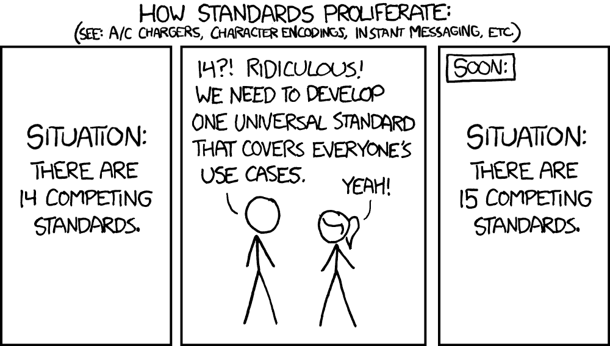
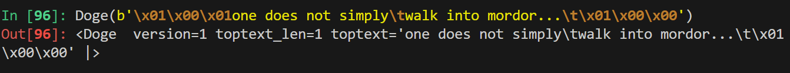

do you get it?
meme_year calc of epoc using meme years (year_length) meme_time
toptext 50 char  (TODO use StrLenField)
bottomtext 50 char
gotum 0 or 1 - IntEnumField "uhh", "deez-nuts"
doge_png  LongField 34332 bytes for img of doge.png
do_you_get_it aka checksum 
┌───────────────────────┬───────────────────┬───────────────────┬───────────┬───────────┬──────────────────────────────────────────────────────────────┬──────────────────┐
│                       │                   │                   │           │           │                                                              │                  │
│ meme year             │  meme time        │  year_length      │  top text │ bottom tex│    dog_png   34332bytes                                      │gotum             │
│                       │                   │                   │           │           │                                                              │                  │
└───────────────────────┴───────────────────┴───────────────────┴───────────┴───────────┴──────────────────────────────────────────────────────────────┴──────────────────┘


source: https://xkcd.com/927/

# how to use doge protocol
```bash
pip3 install ipython scapy
ipython
%run ./main.py
shiztu = Doge(version=1, toptext="one does not simply", bottomtext="walk into mordor...", doge_png="todo", gotum=1)
shiztu = Doge(version=1, toptext="one does not simply", bottomtext="walk into mordor...", gotum=1)
shiztu = Doge(version=1, toptext="one does not simply", bottomtext="walk into mordor...", gotum=2, doge_png=open("./doge.png","rb").read() )
shiztu = Doge(version=1,   gotum=2, doge_png=open("./doge.png","rb").read() )
packet = IP(dst="192.168.1.1", src="192.168.1.68")/UDP()/Doge(version=1, toptext="one does not simply", bottomtext="walk into mordor...", gotum=1)

ls(Doge)
shiztu.show()
raw(shiztu)
shiztu.show2()
```




# TODO encapsolate the doge protocol in UDP packet
```javascript
all it does is send doge pngs,
its UDP like
doesnt care if you you get the meme ;)
```